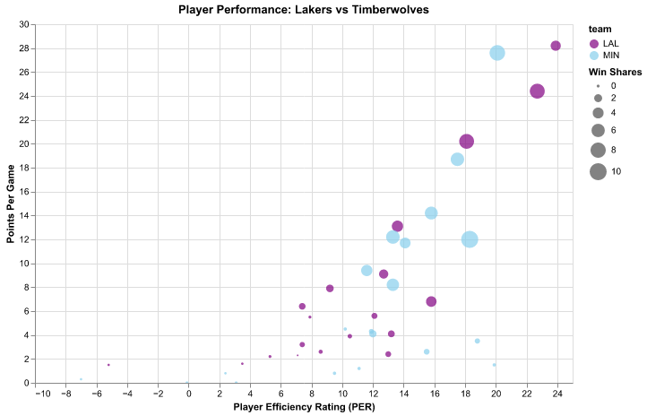
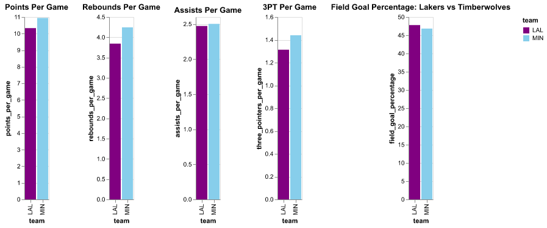
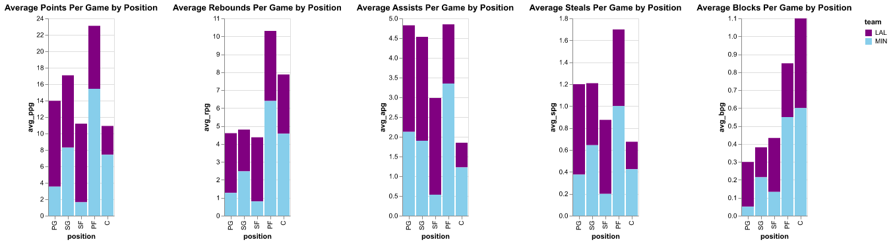

# **Final Report: 2025 NBA Playoff Matchup Analysis: Los Angeles Lakers vs. Minnesota Timberwolves**

---

## **Introduction**

With the conclusion of the 2025 NBA regular season and the start of the playoffs, it is an exciting time for basketball fans as we look forward to the intense playoff matchups. The **Los Angeles Lakers** secured the third seed in the Western Conference playoffs, largely due to a bold trade that sent their star big man, **Anthony Davis**, to the **Dallas Mavericks** in exchange for the young superstar **Luka Dončić**. This move reshaped the Lakers' team dynamics and positioned them as a formidable contender for the postseason.

For their first-round matchup, the Lakers will face the **Minnesota Timberwolves**—a team that has quietly performed well during the regular season, despite not being in the limelight as much as other playoff teams. This report aims to explore the impact of individual player performances for both teams, compare their overall team statistics, assess positional matchups, and dive into the age and experience trends that could influence the outcome of the series.

---

## **Data Source**

The data for this analysis was sourced from a detailed dataset of NBA player statistics for the 2025 regular season. The dataset includes various performance metrics for all NBA players, such as points, rebounds, assists, shooting percentages, and advanced statistics like player efficiency rating (PER), win shares, and usage percentage. The dataset was cleaned and processed to focus on the relevant teams—the **Los Angeles Lakers** and the **Minnesota Timberwolves**—and their key players. Additional calculations were made where necessary, such as points per game, rebounds per game, and turnover percentage, to ensure accurate analysis.

---

## **Goals and Tasks**

The primary goals of this analysis are to provide an in-depth look at player performances, compare team statistics, analyze positional matchups, and examine trends related to age and experience. These goals are key to understanding the dynamics of the **Lakers** vs. **Timberwolves** matchup and how statistical factors could influence the outcome of the series. Specifically, we aim to:

1. **Examine the top-performing players on both teams** to understand their contribution and impact on the team's success.
2. **Compare team performance** to identify which team holds the statistical edge in various key areas.
3. **Analyze positional matchups** to highlight potential advantages or mismatches.

These goals directly influence the design of our visualizations and the analysis performed on the data.

---

## **Key Elements of Visualization Design**

The visualizations created for this report were designed with the following key elements in mind:

1. **Interactive and Clear Visuals:** I used interactive visualizations to allow stakeholders to explore the data at a granular level. Altair was used to create scatter plots, bar charts, and line graphs, ensuring that the visualizations were not only informative but also easy to interpret. For example, **scatter plots** were used to compare player statistics like points, assists, and rebounds, while **bar charts** provided insights into key metrics like field goal percentages and turnovers.

2. **Color-Coding by Team:** To enhance clarity and allow easy comparison between the two teams, **purple** was used for the **Lakers**, and **sky blue** was used for the **Timberwolves**. This color scheme ensures that each team's data is clearly distinguishable, making it easier for viewers to spot trends and differences.

3. **Focused on Key Performance Indicators (KPIs):** The charts emphasized metrics that are essential to understanding player and team performance. These included **points per game**, **rebounds per game**, **assists per game**, and advanced statistics like **turnover percentage** and **effective field goal percentage**.

4. **Positional Analysis:** A key part of the analysis focused on player positions. Bar charts were used to show performance metrics for each position ('PG', 'SG', 'SF', 'PF', 'C') to illustrate where teams have advantages or weaknesses.

---

## **Visualizations and Insights**

### 1. **Player Performance Scatter Plot**

This interactive scatter plot shows the relationship between points per game and rebounds per game, providing a quick overview of the top players on both teams. The key star players, such as **LeBron James and Luka Doncic** (Lakers) and **Anthony Edwards** (Timberwolves), are highlighted for quick comparison.

### 2. **Team Comparison Charts**

Bar charts comparing the **Lakers** and **Timberwolves** based on key performance metrics such as field goal percentage, rebounds, assists, and turnovers. These charts highlighted a surprising **statistical advantage for the Timberwolves** in several key areas, including **field goal efficiency** and **turnover rate**.

### 3. **Positional Analysis**

Separate charts were created for each position (PG, SG, SF, PF, C), comparing the performance of the Lakers and Timberwolves players at those positions. While the Timberwolves showed strength in the backcourt, the **Lakers** had a clear advantage at **center** and **power forward**, where they could exploit size mismatches.

---

## **Feedback from External Stakeholders**

To ensure the effectiveness of the visualizations and the relevance of the analysis, I recruited a group of basketball fans to review the data and provide feedback. The external stakeholders were pleased with how the visualizations provided a clear understanding of the **star players** on each team and their individual impact. They also found the **team comparison charts** valuable, especially in revealing the **statistical edge** the **Timberwolves** had in areas like shooting efficiency and turnovers. However, they pointed out that the **Lakers** have potential advantages in certain **positional matchups**, especially in the frontcourt, which could play a crucial role in the series outcome.

The stakeholders also emphasized that while statistics play a key role in understanding team dynamics, individual performances in high-pressure playoff games could override these trends. Therefore, the final matchup could depend on how well the **Lakers' veterans** can outperform their younger counterparts on the **Timberwolves**.

---

## **Conclusion**

This analysis provides valuable insights into the **Los Angeles Lakers'** and **Minnesota Timberwolves'** performances throughout the 2025 NBA regular season. The visualizations not only highlight the key star players on both teams but also reveal the **strengths and weaknesses** in their overall playstyles. While the **Timberwolves** hold a statistical advantage in some areas, the **Lakers' experience** and **positional mismatches** may give them the upper hand in the playoff series.

Ultimately, the **Lakers' playoff success** will depend on their ability to **leverage their star players in Luka Doncic and Lebron James**, while the **Timberwolves** will look to capitalize on their **frontcourt advantage** to overcome the Lakers’ experience. The visualizations provided in this report serve as a powerful tool for understanding these dynamics and predicting how the matchup might unfold.
